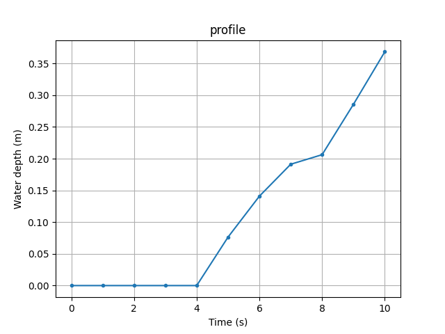

# OpenFOAM water depth probes

A Python script for extracting **time series** data of **water depth** from [OpenFOAM](https://en.wikipedia.org/wiki/OpenFOAM) results. Extracted water depth data are saved in **water_depth.csv**.



In detail, you should:

1. Select `interFoam` module for your OpenFOAM simulation.
2. Define a sampling line (or line probes) in a `sampleDict` object under `system/` directory with following settings. In my case, I name this object as *line* but you can name it whatever you want.

```c++
setFormat        raw;
fields			alpha.water;
```

3. Start your simulation. The sampling result should be saved in a folder under `postProcessing/` directory with the name (e.g., *line*) you define in Step 2. In this folder, you should find `*_alpha.water.xy` files, which store time series data of water depth.
4. Open `get_line_probes.py` with your favorite text editor, and change value of the `input_name` according to your situation. For example, if you set the name as `line` in Step 2, you should define `input_name` as follows:

```python
input_name = "postProcessing/line"  # postProcess folder storing sampling of alpha.water
```

5. Run the script with the following command in your terminal. Water depth is computed at each time step according to where `alpha=0.5`. Results are saved in **water_depth.csv** with columns corresponding to line probes and rows corresponding to time steps.

```bash
python get_line_probes.py
```

# Requirements

* Python 3+
* NumPy
* Pandas
* Matplotlib
* SciPy

# Installation

Download the file [`get_line_probes.py`](get_line_probes.py) and put it in the case OpenFOAM directory, where the `postProcess/` folder is located, and run it by typing:
```bash
$ python get_line_probes.py
```

If you wish to use it repeatedly, a good idea would be to make it executable and add it to your $PATH, which simplifies usage and makes it possible to use it in any directory:
```bash
$ get_line_probes
```

# License

[MIT license](LICENSE)
